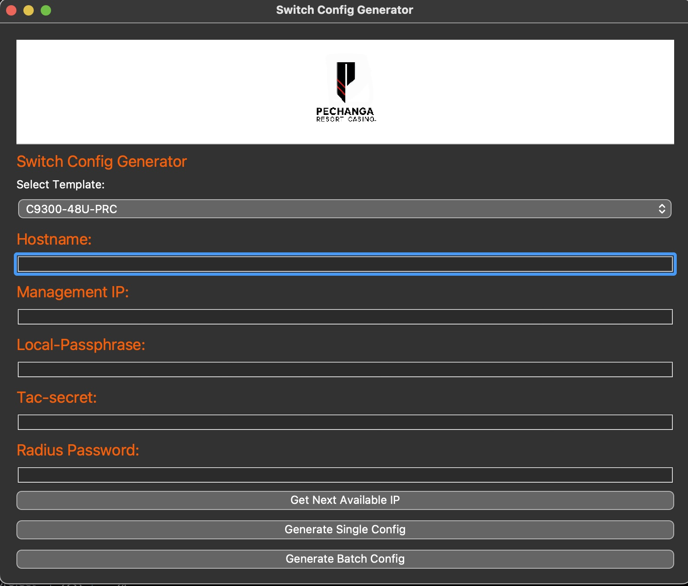

# pyswitches
A test project to create network based switch configs.

 

  # Title: Pyswitch configurator

  
  
  # This is a work in progress!
  
  ## Description: This Project is a python based app that uses pyqt5 for a GUI and is used for creating network based switch configs, in an interactive way.

  ## Usage:  To use the app, the user must have the template they desire for the switch model they want to use in the templates folder, the user then executes the pyswitch.py and a GUI will load. From here the user is presented with two options 1: Fill out the feilds and click generate single config, or 2: click batch mode. If the user wants to create a single config, The user will select the template, fill in the blanks, and if unsure has the option to ask for next avaialbe IP. This will then ask for user credentioals for the infoblox-UI, and it will fill in the IP, then hit generate single config. When the user clicks generate single config, a popup will appear and tell them the name of the file and where it was saved.(in the output folder with a .txt of the hostname) If using batch mode, the user will be asked to select a .csv file(an example is in the repo) the .csv file will have all the info for the batch of configs. The app will then generate them and place them in the output folder.

  ## Questions: johndesgarennes@gmail.com

  ## Github username: jdesgarennes

  ## https://github.com/jdesgarennes/pyswitch

 # Features to add: 
 ## I want to eventually add an option to make the app interactive with a INFOBLOX API, this will allow it to take or find available IP's on the network and even add A records for easy DNS managment. 

## Installation

### Using pip

1. Make sure you have Python installed on your system (Python 3.6 or later).
2. Open a terminal/command prompt.
3. Create a new Python virtual environment (optional but recommended): `python -m venv myenv`
4. Activate the virtual environment:
   - On Windows: `myenv\Scripts\activate`
   - On macOS/Linux: `source myenv/bin/activate`
5. Install the required dependencies: `pip install -r requirements.txt`
6. Run the application: `python pyswitch.py`

### Using conda

1. Make sure you have conda installed on your system (Anaconda or Miniconda).
2. Open a terminal/command prompt.
3. Create a new conda environment: `conda create -n myenv python=3.9`
4. Activate the conda environment: `conda activate myenv`
5. Install the required dependencies: `conda install pyqt`
6. Run the application: `python pyswitch.py`

  ## License type: MIT

