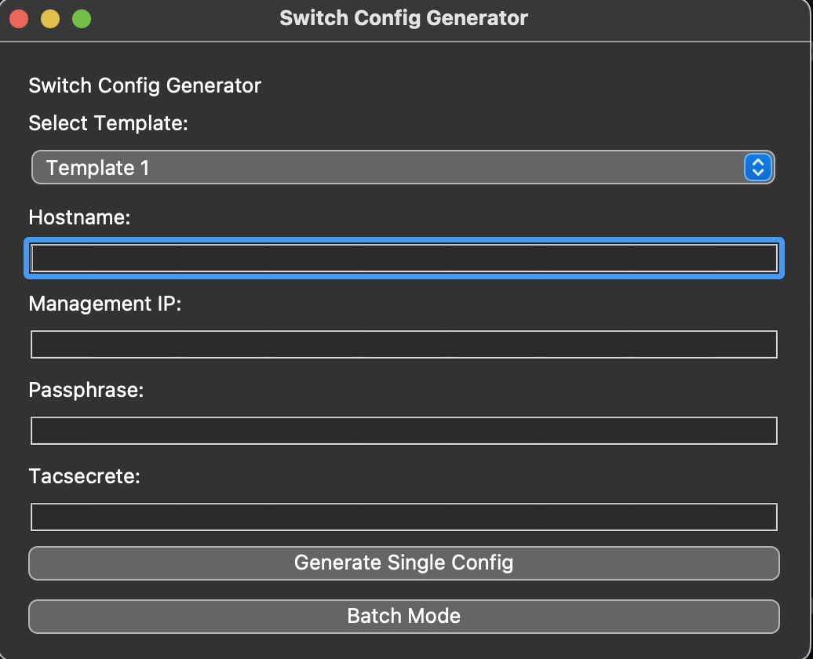

# pyswitches
A test project to create network based switch configs.

 

  # Title: Pyswitch configurator

  
  
  # This is a work in progress!
  
  ## Description: This Project is a python based app that uses pyqt5 for a GUI and is used for creating network based switch configs, in an interactive way.

  ## Usage:  To use the app, the user must have the template they desire for the switch model they use, in the templates folder, the user then executes the pyswitch.py and a GUI will load. The user will select the template fill in the blanks and hit generate. User must hit generate first before clicking save config. When the user clicks save the config button, they are presented with where to save the output file.

  ## Questions: johndesgarennes@gmail.com

  ## Github username: jdesgarennes

  ## https://github.com/jdesgarennes/pyswitch

 # Features to add: 
 ## I want to eventually add a batch method, this will allow a refrence to a csv file and make bulk configs. Another option is to make the app interactive with a INFOBLOX API, this will allow it to take or find available IP's on the network and even add A records for easy DNS managment. 

  ## License type: MIT

